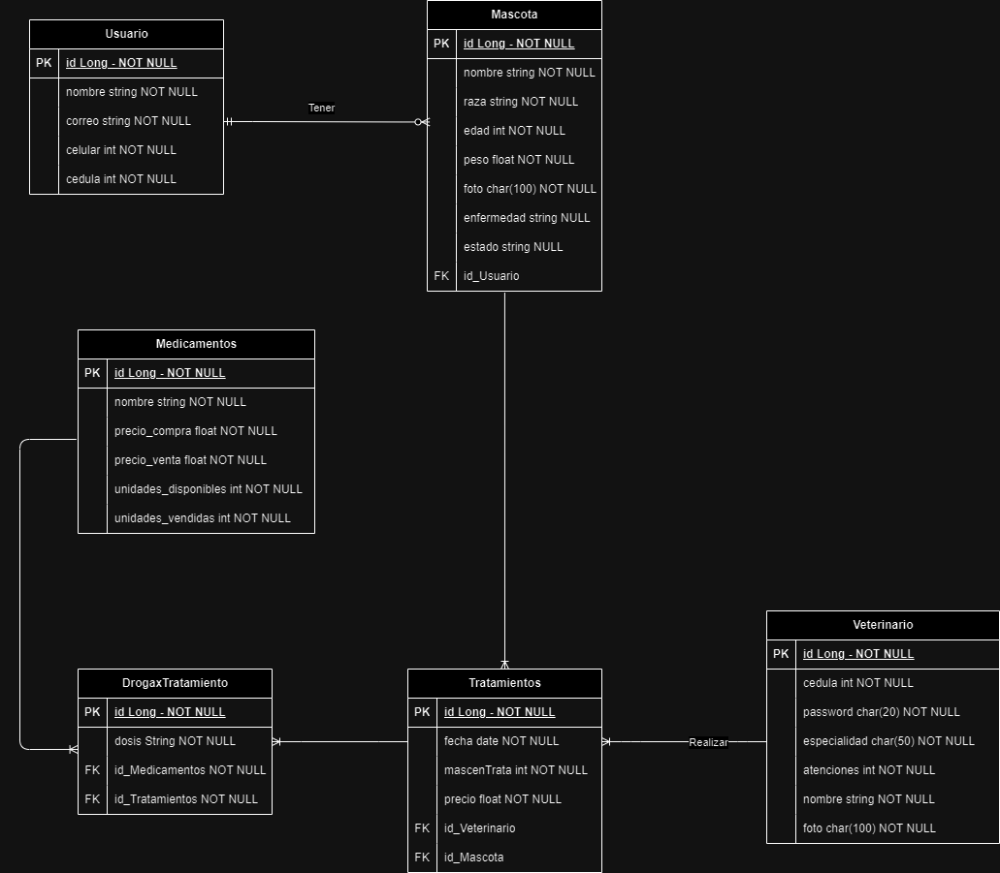
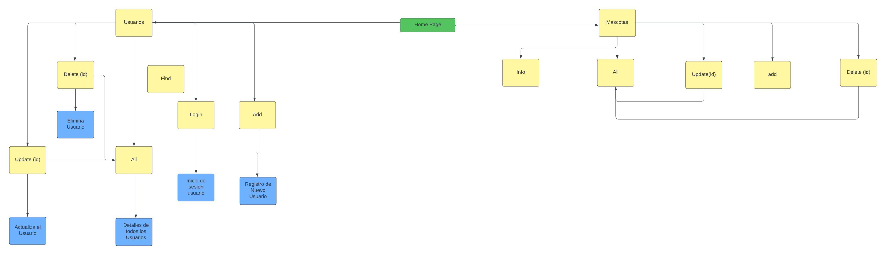

# Proyecto Desarrollo Web
- Pagina web de la veterinaria PetDiatria, diseñado empleando herramientas de programacion.
  
Desarrolladores: 
- Sergio Cuellar Bernal
- Miguel Bayona Rivera
- David Parra Beltran

## Veterinaria Petdiatria

### Descripcion
Esta pagina web proporciona diferentes servicios para tu mascota, un equipo de veterinarios especializado para tratar con la mayor atención posible, permitiendo a los usuarios disfrutar de una gran experiencia junto a sus mascotas.

#### Estructura del Proyecto
- "index.html" -> Cuenta con la página principal de la veterinaria, mostrando opiniones de otros usuarios, productos ofrecidos por la veterinaria, entre otras opciones.
- "admin_dashboard.html" -> Página de administración principal o panel de control.
- "crear_mascota.html" -> Plantilla para la creación de una nueva mascota.
- "crear_usuario.html" -> Plantilla para crear un nuevo usuario.
- "detalles_usuario.html" -> Página que muestra los detalles de un usuario específico.
- "datos_mascota.html" -> Página con los datos de una mascota.
- "error.html" -> Página de error general.
- "find.html" -> Página que se utiliza para buscar información.
- "login_usuario.html" -> Página de inicio de sesión para los usuarios.
- "modificar_mascota.html" -> Página para modificar los datos de una mascota.
- "modificar_usuario.html" -> Página para modificar los datos de un usuario.
- "mostrar_todas_mascotas.html" -> Página que muestra todas las mascotas registradas.
- "mostrar_todos_usuarios.html" -> Página que muestra todos los usuarios registrados.
- "usuario_exitoso.html" -> Página que indica que una operación de usuario se ha completado con éxito.

- "index.css" -> Cuenta con la personalización del "index.html", empleado para darle la estética necesaria a nuestra página.
- "crear_mascota.css" -> Archivo de estilos para la página de creación de mascotas.
- "crear_usuario.css" -> Archivo de estilos para la página de creación de usuarios.
- "datos_mascota.css" -> Estilos para la página que muestra los datos de una mascota.
- "detalles_usuario.css" -> Estilos relacionados con la vista de detalles de los usuarios.
- "error.css" -> Archivo de estilos para la página de errores.
- "login_usuario.css" -> Archivo de estilos para la página de inicio de sesión de usuarios.
- "mostrar_todas_mascotas.css" -> Estilos para la página que muestra una lista de todas las mascotas.
- "usuario_exitoso.css" -> Estilos para una página que parece confirmar una operación exitosa de usuario.

## Diagramas
### Diagrama de Entidad Relacion

## Flujo de Paginas

